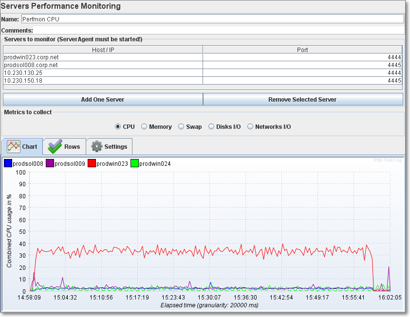
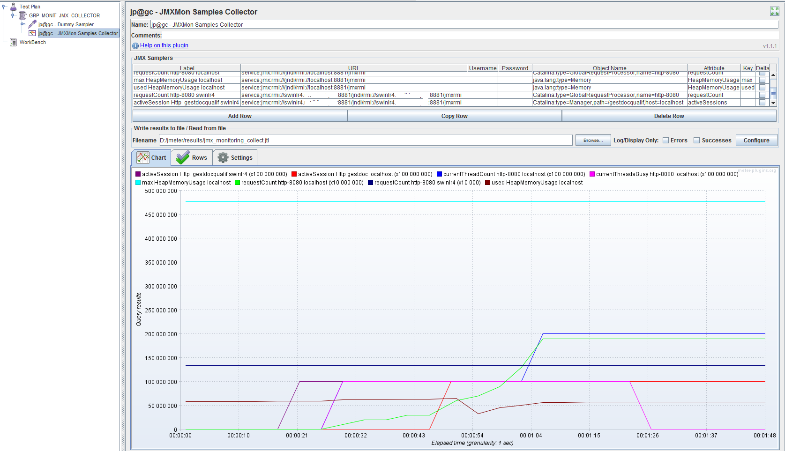

<!-- section 0 -->

# jMeter Workshop {#jmeter-workshop .light-on-dark bgcss="sea-gradient" x="0" y="0" rz="-.1"}

{height="20%" width="20%"}

<!-- section 1 -->

# jMeter Workshop

Agenda:

  Tag 1                           Tag 2
  ------------------------------- ------------------------------
  jMeter Plugin-Manager           Verteiltes Testen mit jMeter
  Strukturierung von Testplänen   RMI
  Workload Design                 Monitoring
  Scripting                       Containerisierung
  Reporting                       CI/CD-Pipeline
  Testdatenverwaltung             Klärung offener Punkte
  REST-APIs                       

<!-- section 2 -->

# jMeter Plugin-Manager {#jmeter-plugin-manager .light-on-dark bgcss="sea-gradient" x="0" y="0" rz="-.1"}

<!-- section 3 -->

# jMeter Plugin-Manager

<https://jmeter-plugins.org/wiki/PluginsManager/>

**Installation:**

-   lade **<https://jmeter-plugins.org/get/>** herunter
-   kopiere **jar** in das jMeter-Verzeichnis **lib/ext**

<!-- section 4 -->

# jMeter Plugin-Manager

**Ausführung über die Kommandozeile:**

<https://jmeter-plugins.org/wiki/PluginsManagerAutomated/>

`PluginsManagerCMD <command> [<params>]`

z.B.

`PluginsManagerCMD install jpgc-fifo,jpgc-json=2.2`

<!-- section 5 -->

# jMeter Plugin-Manager

**Falls man hinter einem Proxy ist:**

`JVM_ARGS="-Dhttps.proxyHost=myproxy.com -Dhttps.proxyPort=8080 -Dhttp.proxyUser=john -Dhttp.proxyPass=***" PluginsManagerCMD status`

<!-- section 6 -->

# jMeter Plugin-Manager

**Eigenes Plugin schreiben:**

<https://jmeter.apache.org/usermanual/jmeter_tutorial.html>

**Eigenes Repository hinzufügen:**

jMeter-Property setzen:

`jpgc.repo.address=https://jmeter-plugins.org/repo/;http://my.intranet.site/plugins-repo.json`

Das Repository-JSON muss folgendes Format erfüllen: <https://jmeter-plugins.org/wiki/PluginRepositoryDescriptorFormat/>

<!-- section 7 -->

# jMeter Plugin-Manager

**Nützliche Plugins:**

-   Custom Thread Groups
-   JMXMon Sample Collector
-   jp\@gc - PerfMon
-   jp\@gc - Dummy Sampler
-   jp\@gc - PlanCheck

<!-- section 8 -->

# jMeter Plugin-Manager

**Ultimate Thread Group**

{height="40%" width="40%"}

<!-- section 9 -->

# jMeter Plugin-Manager

**Concurrency Thread Group**

{height="40%" width="40%"}

<!-- section 10 -->

# jMeter Plugin-Manager

**jp\@gc - PerfMon**

{height="40%" width="40%"}

<!-- section 11 -->

# jMeter Plugin-Manager

**jp\@gc - Dummy Sampler**

{height="40%" width="40%"}

<!-- section 12 -->

# jMeter Plugin-Manager

**jp\@gc - PlanCheck**

<https://jmeter-plugins.org/wiki/TestPlanCheckTool/>

Usage:

`jmeter/lib/ext/TestPlanCheck.sh --jmx MyTestPlan.jmx --stats --tree-dump`

<!-- section 13 -->

# jMeter Plugin-Manager

**JMXMon Sample Collector**

{height="40%" width="40%"}

<!-- section 14 -->

# Strukturierung von Testplänen {#strukturierung-von-testplänen .light-on-dark bgcss="sea-gradient" x="0" y="0" rz="-.1"}

<!-- section 15 -->

# Thread Groups, Sampler und Controller

<!-- section 16 -->

# Timers

<!-- section 17 -->

# Assertions und Listener

<!-- section 18 -->

# Pre- und Post-Prozessoren

<!-- section 19 -->

# Config-Elemente, Cookie-Manager, Header-Manager

<!-- section 20 -->

# User-definierte Variable

<!-- section 21 -->

# Workload Design {#workload-design .light-on-dark bgcss="sea-gradient" x="0" y="0" rz="-.1"}

<!-- section 22 -->

# Worload

> The amount of work a system has to perform in a given time. In the performance field, a workload usually refers to combined load placed on an application by the set of clients it services

<!-- section 23 -->

# Prinicples

-   Vorhersagbarkeit

-   Wiederholbarkeit

-   Skalierbarkeit

<!-- section 24 -->

# Vorhersagbarkeit

> Das Verhalten des Systems (z.B. Prozessanfragen, Datenzugriffe, ...) sollte während die Workload läuft vorhersehbar sein.

<!-- section 25 -->

# Wiederholbarkeit

> Wenn eine Workload mehrere male auf identische Weise ausgeführt wird, sollte die Ergebnis nahezu identisch ausführen. Ansonsten wird eine Performance-Analyse sehr schwer.

<!-- section 26 -->

# Skalierbarkeit

> Eine Workload solle mit unterschiedlichen Lasten ausgeführt werden können um die Skalierbarkeit der Anwendung testen zu können.

<!-- section 27 -->

# Workload Design Steps

-   Design der Applikation

-   Definieren der Metriken

-   Design der Load

-   Definieren der Skalierungsregeln

-   Design des Load-Generators

<!-- section 28 -->

# Design der Applikation

-   Definieren der Aktoren und Use-Cases → Hilft die Operationen der Workload zu definieren

-   Definieren der Operationen

    -   Im einfachsten Fall mappt jeder User-Case auf eine Operation
    -   Für sinnvolle Workloads solle die Zahl der benötigen Operation klein gehalten werden (6-8) → Ansonsten schwer zu managen und verstehen

<!-- section 29 -->

# Definieren der Metriken

Typische Metriken sind:

-   **Durchsatz:** Wie viele Operation können vom SUT während einer gewissen Zeit verarbeitet werden

-   **Anwortzeiten:** Zeit zwischen Ende der Anfrage und Beginn der Anwort an das SUT → Macht normalerweise nur Sinn wenn es auch Anforderungen für Antwortzeiten gibt

-   **Anzahl Benutzer:** Wie viele Benutzer können gleichzeitig auf dem SUT arbeiten ohne das es zu Probleme kommt

<!-- section 30 -->

# Design der Load

-   der wichtigste Schritt im Workload Design!

-   die Relevanz der Workload hängt davon ab wie genau sie die die reale Produktionslast emuliert

-   gleichzeit wichtig: die Test-Workload solle sich auf die signifikanten Aspekte der Live-Load konzentrieren → Ansonsten wird es zu kompliziert

<!-- section 31 -->

# Design der Load

-   **Arrival Rates:** Die Rate mit der Requests an das SUT gestellt werden

-   **Think Times:** Zeit zwischen Anzeige der Daten beim Benutzer und seiner nächsten Interaktion → Bei großen Datenmenge steigt diese Zeit

-   **Operation Mix:** Festlegung in welcher Frequenz welche Operation durchgeführt wird

-   **Operation Data:**

-   **Uniform Random:**

-   **Non-Uniform Random:**

## Definieren der Skalierungsregeln

<!-- section 32 -->

# Workload Design

-   Baseline Test
-   Identifikation der Test Szenarien
-   Preprocessors und Timer ()
-   Konfigurationen und Vorbedingungen
-   Testergebnisse, Fehler und Logs
-   Assertions und Post-Processors
-   Adding load to mimic users action

<!-- section 33 -->

# Baseline Test

> "A Baseline is the process of capturing performance metric data for the sole purpose of evaluating the efficacy of successive changes to the system or application. It is important that all characteristics and configurations, except those specifically being varied for comparison, remain the same in order to make effective comparisons as to which change (or series of changes) is driving results toward the targeted goal. Armed with such baseline results, subsequent changes can be made to the system configuration or application and testing results can be compared to see whether such changes were relevant or not." Some considerations when generating baselines include the following:\"

https://www.oreilly.com/library/view/performance-testing-with/9781787285774/8c67a2ab-7bda-4a64-bb90-6c0b8785ad60.xhtml

<!-- section 34 -->

# Identifikation der Test Szenarien

<!-- section 35 -->

# Zeitliche Verteilung der Last

<!-- section 36 -->

# Erkennen der Last-Grenzen / Server-Bedarfs

<!-- section 37 -->

# Scripting {#scripting .light-on-dark bgcss="sea-gradient" x="0" y="0" rz="-.1"}

<!-- section 38 -->

# BeanShell

<!-- section 39 -->

# JSR223

<!-- section 40 -->

# RegEx-Extractor

<!-- section 41 -->

# Arbeiten mit JARs

<!-- section 42 -->

# Reporting {#reporting .light-on-dark bgcss="sea-gradient" x="0" y="0" rz="-.1"}

<!-- section 43 -->

# Arten von Reporting

<!-- section 44 -->

# Ergebnis-Analyse

<!-- section 45 -->

# Testdatenverwaltung {#testdatenverwaltung .light-on-dark bgcss="sea-gradient" x="0" y="0" rz="-.1"}

<!-- section 46 -->

# Testdaten in .json-Datei / .csv-Datei

<!-- section 47 -->

# jMeter-Funktionen zur Datengenerierung

<!-- section 48 -->

# REST-APIs {#rest-apis .light-on-dark bgcss="sea-gradient" x="0" y="0" rz="-.1"}

<!-- section 49 -->

# Nutzung des Test-Rekorders

<!-- section 50 -->

# Testen mit "Http-Request"

<!-- section 51 -->

# Umgang mit Sessions/Authentification

<!-- section 52 -->

# Umgang mit dynamischen Daten

<!-- section 53 -->

# Verteiltes Testen mit jMeter {#verteiltes-testen-mit-jmeter .light-on-dark bgcss="sea-gradient" x="0" y="0" rz="-.1"}

<!-- section 54 -->

# Master-Slave-Setup

<!-- section 55 -->

# Testausführung über CLI

<!-- section 56 -->

# RMI {#rmi .light-on-dark bgcss="sea-gradient" x="0" y="0" rz="-.1"}

<!-- section 57 -->

# Diskussion: aktueller verwendeter RMI-Sampler

<!-- section 58 -->

# Vergleich mit existierende RMI-Samplern auf Github

<!-- section 59 -->

# Monitoring {#monitoring .light-on-dark bgcss="sea-gradient" x="0" y="0" rz="-.1"}

<!-- section 60 -->

# Prometheus / Grafana

<!-- section 61 -->

# YourKit-Profiler

<!-- section 62 -->

# Containerisierung {#containerisierung .light-on-dark bgcss="sea-gradient" x="0" y="0" rz="-.1"}

<!-- section 63 -->

# IaC: Infrastructure as a Code

> Mit IaC (Infrastructure as Code) wird die Infrastruktur durch Code -- und nicht durch manuelle Prozesse -- verwaltet und provisioniert.

> Mit IaC werden Konfigurationsdateien erstellt, die Ihre gesamten Infrastrukturspezifikationen enthalten, wodurch Sie Konfigurationen einfacher bearbeiten und verteilen können.
> Es stellt außerdem sicher, dass Sie jedes Mal dieselbe Umgebung provisionieren.

> Ein wichtiger Bestandteil von IaC ist die Versionskontrolle. Wie jede andere Software-Quellcodedatei sollten auch Ihre Konfigurationsdateien der Quellkontrolle unterliegen.

<!-- section 64 -->

# Vagrant + Ansible

Ansible Playbook: <https://galaxy.ansible.com/lean_delivery/jmeter>

<!-- section 65 -->

# Docker / Docker-Compose

<!-- section 66 -->

# Kubernetes

<!-- section 67 -->

# CI/CD-Pipeline {#cicd-pipeline .light-on-dark bgcss="sea-gradient" x="0" y="0" rz="-.1"}

<!-- section 68 -->

# Github Actions

https://github.com/marketplace/actions/setup-jmeter
https://github.com/marketplace/actions/apache-jmeter
https://github.com/marketplace/actions/perfaction-for-jmeter
https://www.redline13.com/blog/2021/10/github-actions-for-jmeter/
https://dev.to/sebiboga/generate-jmeter-test-report-and-save-it-as-artifact-with-github-actions-4a6b
https://stackoverflow.com/questions/68084554/fail-github-actions-pipeline-if-dockerized-jmeter-tests-failed

<!-- section 69 -->

# jMeter in einer Github-Actions Pipeline

<!-- section 70 -->

# JMeter in einer Jenkins-Pipeline

<!-- section 71 -->

# Klärung offener Punkt {#klärung-offener-punkt .light-on-dark bgcss="sea-gradient" x="0" y="0" rz="-.1"}
