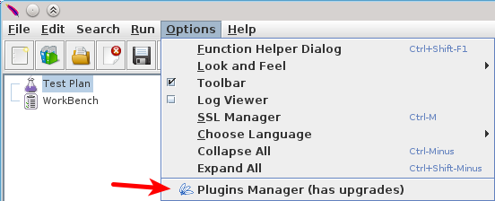
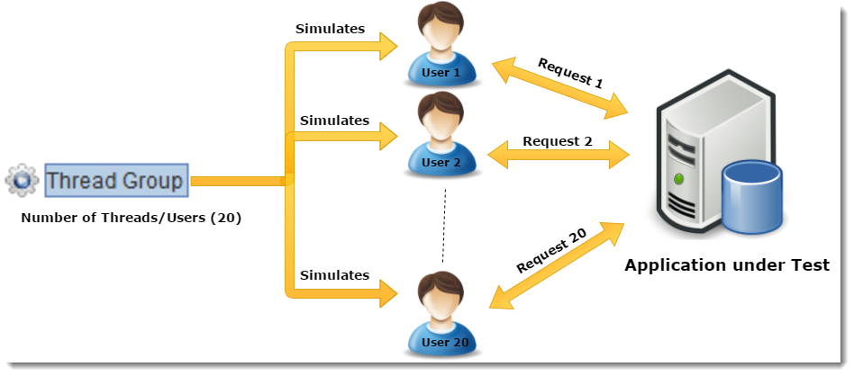
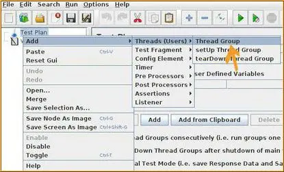
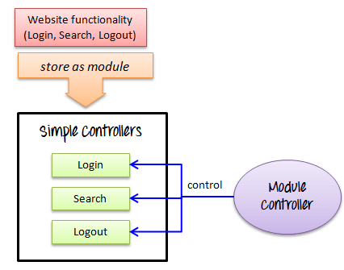

<!-- section 0 -->

# jMeter Workshop {#jmeter-workshop .light-on-dark bgcss="sea-gradient" x="0" y="0" rz="-.1"}

{height="20%" width="20%"}

<!-- section 1 -->

# jMeter Workshop

Agenda:

  Tag 1                                 Tag 2
  ------------------------------------- ------------------------------------
  \(3\) jMeter Plugin-Manager           \(3\) Verteiltes Testen mit jMeter
  \(2\) Strukturierung von Testplänen   \(3\) RMI
  \(3\) Workload Design                 \(2\) Monitoring
  \(2\) Scripting                       \(1\) Containerisierung
  \(2\) Reporting                       \(1\) CI/CD-Pipeline
  \(1\) Testdatenverwaltung             Klärung offener Punkte
  \(1\) REST-APIs                       

<!-- section 2 -->

# jMeter Plugin-Manager {#jmeter-plugin-manager .light-on-dark bgcss="sea-gradient" x="0" y="0" rz="-.1"}

<!-- section 3 -->

# jMeter Plugin-Manager

<https://jmeter-plugins.org/wiki/PluginsManager/>

**Installation:**

-   lade **<https://jmeter-plugins.org/get/>** herunter
-   kopiere **jar** in das jMeter-Verzeichnis **lib/ext**

<!-- section 4 -->

# jMeter Plugin-Manager

**Ausführung über die Kommandozeile:**

<https://jmeter-plugins.org/wiki/PluginsManagerAutomated/>

`PluginsManagerCMD <command> [<params>]`

z.B.

`PluginsManagerCMD install jpgc-fifo,jpgc-json=2.2`

<!-- section 5 -->

# jMeter Plugin-Manager

**Falls man hinter einem Proxy ist:**

`JVM_ARGS="-Dhttps.proxyHost=myproxy.com -Dhttps.proxyPort=8080 -Dhttp.proxyUser=john -Dhttp.proxyPass=***" PluginsManagerCMD status`

<!-- section 6 -->

# jMeter Plugin-Manager

**Eigenes Plugin schreiben:**

<https://jmeter.apache.org/usermanual/jmeter_tutorial.html>

**Eigenes Repository hinzufügen:**

jMeter-Property setzen:

`jpgc.repo.address=https://jmeter-plugins.org/repo/;http://my.intranet.site/plugins-repo.json`

Das Repository-JSON muss folgendes Format erfüllen: <https://jmeter-plugins.org/wiki/PluginRepositoryDescriptorFormat/>

<!-- section 7 -->

# jMeter Plugin-Manager

**Nützliche Plugins:**

-   Custom Thread Groups
-   JMXMon Sample Collector
-   jp\@gc - PerfMon
-   jp\@gc - Dummy Sampler
-   jp\@gc - PlanCheck

<!-- section 8 -->

# jMeter Plugin-Manager

**Ultimate Thread Group**

{height="40%" width="40%"}

<!-- section 9 -->

# jMeter Plugin-Manager

**Concurrency Thread Group**

{height="40%" width="40%"}

<!-- section 10 -->

# jMeter Plugin-Manager

**jp\@gc - PerfMon**

{height="40%" width="40%"}

<!-- section 11 -->

# jMeter Plugin-Manager

**jp\@gc - Dummy Sampler**

{height="40%" width="40%"}

<!-- section 12 -->

# jMeter Plugin-Manager

**jp\@gc - PlanCheck**

<https://jmeter-plugins.org/wiki/TestPlanCheckTool/>

Usage:

`jmeter/lib/ext/TestPlanCheck.sh --jmx MyTestPlan.jmx --stats --tree-dump`

<!-- section 13 -->

# jMeter Plugin-Manager

**JMXMon Sample Collector**

{height="40%" width="40%"}

<!-- section 14 -->

# Elemente/Strukturierung von Testplänen {#elementestrukturierung-von-testplänen .light-on-dark bgcss="sea-gradient" x="0" y="0" rz="-.1"}

<!-- section 15 -->

# Elemente/Strukturierung von Testplänen

-   Thread Groups
-   Sampler
-   Controller
-   Timers
-   Assertions
-   Listener
-   Pre-/Post-Prozessoren
-   Configuration Elements
-   Cookie-Manager
-   Header-Manager
-   Variablen / Properties
-   Testfragment
-   Templates
-   Ausführungsreihenfolge

<!-- section 16 -->

# Thread Groups

> A Thread Group in JMeter represents a pool of virtual users performing a set of operations

<!-- section 17 -->

# Thread Groups

Wichtigste Einstellungen:

-   Anzahl Threads
-   Anzahl der Wiederholungen
-   Ramp-Up-Zeit einstellen (wichtig z.B. für Spike-Testing bei Ticketverkauf!)

<!-- section 18 -->

# Thread Groups

**Beispiel: Google-Suche**

-   Ein Teil der Nutzer verwendet die Text-Suche, andere die News- oder Bilder-Suche

-   Hierfür kann man verschieden Thread-Gruppen mit unterschiedlichem Thread-Count anlegen

-   In diesen Thread-Gruppen werden diverse Sampler (z.B. Http-Requests) hinzugefügt um die Benutzer-Requests zu simulieren

<!-- section 19 -->

# Thread Groups

**Load Testing:** Modeliert die erwartete Benutzung
**Stress Testing:** Bestimmung des Limits an Concurrent Usern bis fehler auftreten
**Soak Testing:** Festgelegte Load die über einen definierten Zeitraum aufrecht erhalten wird
**Spike Testing:** testen von schnellem Anstieg/Abfall der Load -\> z.B. Ticketverkauf

  ----------------------------------------------------------------------------------------------------------------
  Name                              Use-Cases
  --------------------------------- ------------------------------------------------------------------------------
  Thread Group (classic)            Einfache Szenarios, Stress Testing, Soak Testing

  Arrivals Thread Group             Soak Testing, wie verhält sich die App wenn all n-Minuten x-User hinzukommen

  Free Form Arrivals Thread Group   Use-Cases vergleichbar mit Arrival Thread Group

  Concurrency Thread Group          Wie klassiche Threadgroup. Aber einfacher und weniger Speicherbedarf

  Stepping Thread Group             Ältere Version der Threadgroup mit mehr Konfigurationsaufwand

  Ultimate Thread Group             Komplexe Spike Testing Szenarios

  -------------------------------   ---------------------------------------------------------------------

  setUp Thread Group                Vorbereiten der Testumgebung (z.B. VM/Container starten, DB befüllen)

  tearDown Thread Group             Aufräumen der Testumgebung
  ----------------------------------------------------------------------------------------------------------------

<!-- section 20 -->

# Sampler

> Durch Threadgruppen werden Benutzer-Anfragen an den Server simuliert.
> Sampler legen die Art des Requests fest!

<!-- section 21 -->

# Sampler

-   FTP Request
-   HTTP Request (can be used for SOAP or REST Webservice also)
-   JDBC Request
-   Java object request
-   JMS request
-   JUnit Test request
-   LDAP Request
-   Mail request
-   OS Process request
-   TCP request

<!-- section 22 -->

# Sampler

-   Falls man mehrere Requests des gleichen Type versendet → Überlegen of *Defaults Configuration Element* nützlich sein könnte

-   OS Process request: Häufig nützlich in setUp/tearDown-Szenarien

-   Sollte man auch bei den Plugins keinen passen Sampler finden → Es lassen sich auch eigene Sampler schreiben. Häufig findet sich auch auf Github etwas!

<!-- section 23 -->

# Controller

> Logische Controller legen fest wann/welche Sampler verwendet werden

<!-- section 24 -->

# Controller

> Ziel des Module Controllers ist es Modularität zu jMeter hinzuzufügen, z.B. bei Webapps (Login, Suche, ...)

<!-- section 25 -->

# Controller

Beispiel: 100 Benutzer loggen sich ein, 30 Benutzer suchen auf google und 50 Benutzer loggen sich aus

<!-- section 26 -->

# Controller

Der Module-Controller kontrolliert welches Modul laufen soll

<!-- section 27 -->

# Controller

Weiter wichtige Controller:

-   **Interleave Controller:** wählt Request und führt diesen einaml in jedem Loop des Threads durch
-   **Runtime Controller:** kontrolliert wie lange seine Kinder laufen dürfen
-   **Transaction Controller:** Stoppt Gesamtzeit des Testdurchführung, z.B. Dauer des Logins
-   **Include Controller:** Hierdurch lassen sich externe Testpläne nutzen

<!-- section 28 -->

# Timers

> Durch Timer läßt sich in jMeter ein Delay zwischen den Sampler definieren

-   Ohne delay könnten zu viele Requests in kurzer Zeit den Server überlasten

-   Fügt man mehr als einen Timer zur Thread-Gruppe summiert jMeter die Timer-Zeit und pausiert so lange

-   Um Pause an einer bestimmten Stelle im Test Plan zu machen → Flow Control Action Sampler

<!-- section 29 -->

# Assertions

> Über Assertions läßt sich prüfen ob sich die Applikation unter Last wie erwartet verhält

-   Beispiel: Response enthält bestimmten Text?

-   Um Assertion-Ergebnisse anzuzeigen muss man einen entsprechenden Listener zur Thread-Gruppe hinzufügen

<!-- section 30 -->

# Assertions

> Scope beachten!

<!-- section 31 -->

# Assertions

> Performance beachten!

  Assertion              CPU/Memory usage   Info
  ---------------------- ------------------ ------------------------------------
  Response Assertion     moderat            Regular Expressions
  Duration Assertion     gering             
  Size Assertion         gering             
  XML Assertion          hoch               Builds XML DOM Documents
  Beanshell Assertion    Variable           Depends on the script logic
  MD5Hex Assertion       gering             
  HTML Assertion         hoch               Parses the HTML Response
  XPath Assertion        hoch               Builds XML DOM Documents
  XML Schema Assertion   hoch               Builds XML DOM Documents
  JSR223 Assertion       Variable           Depends on the script logic
  Compare Assertion      hoch               Parses responses and compares them
  SMIME Assertion        moderat            
  Json Assertion         hoch               Parses the Json document

**gering:** Kann ohne Probleme genutzt werden
**moderat:** Sparsam einsetzen, insbesondere bei größeren Serverantworten (100kbs bis mehrere MB)
**hoch:** größtenteils nur für funktionales Testen oder leichte Last (\<10 concurrent Usern) passend

<!-- section 32 -->

# Assertions

Beispiel: Eigene JSR223 Assertion um Durations zu prüfen

\`
def response\_time = prev.getTime().toInteger();

def expected\_response\_time = 0;

if (response\_time \> expected\_response\_time) {
AssertionResult.setFailure(true);
AssertionResult.setFailureMessage("The expected response time is :" + expected\_response\_time + "ms but it took:" + response\_time + "ms");
}
\`

<!-- section 33 -->

# Listener

> Zeigen die Ergebnisse der Testdurchführung

<!-- section 34 -->

# Listener

<!-- section 35 -->

# Listener

-   Sammeln Ergebnisse von Elementen auf gleichem Level oder darunter

-   Listener können sehr Ressourcenintensiv sein, wenn es viel Samples gibt!

    -   Nicht bei Load-/Stress-Tests verwendet werden sollten:
    -   Assertion Results
    -   View Results in Table
    -   View Results Tree

-   Eregebnisse können auch in Files (csv, xml) zur weiterverarbeitung weggeschrieben werden

    -   Der Default der zu speichernden Werte kann in jmeter.properties bzw. user.properties definiert werden
    -   für mehr Details siehe: → 

<!-- section 36 -->

# Listener

**CLI-Modus:** mit dem *-l Flag can ein Top-Level listener benutzt werden zusätzlich zu den im Testplan definierten Listenern*

`jmeter -n -t testplan.jmx -l testplan_01.jtl -j testplan_01.log`

Generieren eines HTML-Reports aus .jtl-Dateien:

´./bin/jmeter -g JTL\_FILE -o OUTPUT\_FOLDER\`

<!-- section 37 -->

# Listener

**Real-Time-Results:** seit jMeter 2.13 unterstützt jMeter Real-Time-Results, z.B. für Grafana. Details: → 

<!-- section 38 -->

# Listener

<!-- section 39 -->

# Pre- und Post-Prozessoren

> Pre-/Post-Prozessoren werden vor/nach Sampler-Request ausgeführt

-   Ist ein Pre-/Post-Prozessor direkt an einen Sampler angehängt wird er direkt vor/nach diesem Sampler ausgeführt

-   Häufigste Use-Cases:

    -   Pre-Prozessor:
        -   Settings eines Requests direkt bevor er läuft verändern
        -   Variablen Updaten die nicht aus dem Response-Text extrahiert werden.
    -   Post-Prozessor:
        -   Verarbeiten der Response Daten, z.B extrahieren von Daten (Regex, Json, ...)

<!-- section 40 -->

# Configuration Elements

> Arbeiten eng mit Samplern zusammen. Kann zwar keine Requests senden, diese aber verändern

Beispiel: Setzen von Defaults und Variablen die später von Samplern verwendet werden können

-   Zugriff nur innerhalb des Zweiges in dem das Element hinzugefügt wurde

-   Settings werden normalerweise gemerged, wobei Elemente tiefer im Baum vorrang haben.

    -   Ausnahme: *User Defined Variables* werden unabhängig von der Position zu Beginn des Test verarbeitet
    -   → Empfehlung daher: *User Defined Variables* sollten am Start der Thread-Gruppe positioniert werden

Header Manager, Cookie Manager und Authorization Manager stellen einen weitern Sonderfall dar:

-   Setting werden nicht gemerged

-   Gibt es mehr als einen Manager im Scope wird nur einer verwendet. Es lässt sich allerdings nicht festlegen welcher!

<!-- section 41 -->

# Configuration Elements

-   **Cache-Manager:**: Falls man Last-Tests mit Cache durchführen möchte, z.B. für Web-Apps

-   **Cookie-Manager:** Falls man Anwendung mit Cookies testen möchten, z.B. Auth bei Web-Apps

-   **Header-Manager:** Kann HTTP Request-Header überschreiben, z.B. Authorization-Header für JWTs bei Web-Apps

<!-- section 42 -->

# Properties / Variablen

**Properties:**

-   sind global in jMeter

-   wird meistens für jMeter Default-Werte genutzt → Beispiel: remote\_hosts

-   [können in Testplänen referenziert werden](https://jmeter.apache.org/usermanual/functions.html#__property)

-   setProperty kann genutzt werden um eine jMeter-Property zu definieren → Da diese Global sind können hierdurch bei Bedarf Informationen zwischen den Threads ausgetauscht werden!

<!-- section 43 -->

# Properties / Variablen

**Variablen:**

-   lokal für jeden Thread

-   Wird eine Variable in einem Thread upgedated wird nur die Thread-Kopie der Variable verändert!

-   Durch den Testplan definierte Variablen und "User Defined Variables" werden zum Start innerhalb des Testplans verfügbar gemacht

-   Bei mehrfach-Definition gewinnt die letzte Definition!

-   Nützlich um Tests zu parametrisieren → Identifikation von Werten die innerhalb eines Test-Runs konstant bleiben!

<!-- section 44 -->

# Configuration Elements

Beispielparametrisierung:

  Variable   Wert
  ---------- -----------------
  HOST       www.example.com
  THREADS    10
  LOOPS      20

wird zu

  Variable   Wert
  ---------- ---------------------------------
  HOST       \${\_\_P(host,www.example.com)}
  THREADS    \${\_\_P(threads,10)}
  LOOPS      \${\_\_P(loops,20)}

Aufruf: `jmeter … -Jhost=www3.example.org -Jloops=13` (Alternativ: entsprechende user.properties setzen)

Zugriff innerhalb des Testplans auf die Werte: \${HOST}, \${THREADS}, \${LOOPS}

<!-- section 45 -->

# Testfragment

> Testfragmente sind eine spezielle Art von Controller auf Ebene des Thread Group Elements. Man unterscheidet zwischen *Test Fragment Nodes* und *test Fragment Files*. *Test Fragment Nodes* lassen sich nicht in *Test Fragment\_Files* inkludieren!

-   wird nicht ausgeführt solange es nicht in einem Modul-Controller oder Include-Controller refereniert wird.

    -   → Ermöglicht gleichzeitges Arbeiten an modulen in separaten Files

-   Dient der Code-Wiederverwendung innerhalb von Testplänen und hilft sehr große Testpläne wartbar zu machen

-   Details: → 

<!-- section 46 -->

# Testfragment

> Hilft unterschiedliche Workflows zu unterstützen

  Funktionalitäten einer Beispielapp
  ----------------------------------------------
  Login
  Logout
  User Registration
  Search for Product
  Select Product
  Order Product with different payment methods
  Edit Order
  Cancel Order
  Search for User Profile

-   Workflow 1: User Registration -\> Search for Product -\> Select Product -\> Order Product -\> Logout
-   Workflow 2: Login -\> Search for Product -\> Select Product -\> Order Product -\> Logout
-   Workflow 3: Login -\> Search for User -\> Cancel Order -\> Logout
-   Workflow 4: Login -\> Search for Product

<!-- section 47 -->

# Templates

> Skeleton Script die wiederverwendbar sind um mit einem Projekt zu starten

Erzeugung eines Templates:

-   .jmx-File in /templates abspeichern

-   Template.xml öffnen und Daten für eigenes Template ergänzen

-   Nach jMeter-Neustart kann Template ausgewählt werden

-   Es existier etliche Templates auf Github, z.B. zum Testen von Wordpress-Apps → 

> Tipp: Aufbau der Beispiel-Templates studieren!

<!-- section 48 -->

# Ausführungsreihenfolge

-   Configuration Elements
-   Pre-Processors
-   Timers
-   Sampler
-   Post-Processors
-   Assertions
-   Listeners

<!-- section 49 -->

# Ausführungsreihenfolge

-   Timers, Assertions, Pre-/Post-Processors werden nur ausgeführt, wenn es einen Sampler gibt auf den sie sich beziehen können!
-   Logic-Controller und Sampler werden in der Reihenfolge in der sie im Baum stehen ausgeführt
-   Andere Testelemente werden entsprechend ihres Scopes ausgeführt

Beispiel-Testplan:

-   Controller
    -   Post-Processor 1
    -   Sampler 1
    -   Sampler 2
    -   Timer 1
    -   Assertion 1
    -   Pre-Processor 1
    -   Timer 2
    -   Post-Processor 2

Ausführungsreihenfolge:

Pre-Processor 1
Timer 1
Timer 2
Sampler 1
Post-Processor 1
Post-Processor 2
Assertion 1

Pre-Processor 1
Timer 1
Timer 2
Sampler 2
Post-Processor 1
Post-Processor 2
Assertion 1

<!-- section 50 -->

# Workload Design {#workload-design .light-on-dark bgcss="sea-gradient" x="0" y="0" rz="-.1"}

<!-- section 51 -->

# Workload

Definition:

> The amount of work a system has to perform in a given time. In the performance field, a workload usually refers to combined load placed on an application by the set of clients it services

<!-- section 52 -->

# Prinzipien

-   Vorhersagbarkeit

-   Wiederholbarkeit

-   Skalierbarkeit

<!-- section 53 -->

# Vorhersagbarkeit

> Das Verhalten des Systems (z.B. Prozessanfragen, Datenzugriffe, ...) sollte während die Workload läuft vorhersehbar sein.

<!-- section 54 -->

# Wiederholbarkeit

> Wenn eine Workload mehrere male auf identische Weise ausgeführt wird, sollte die Ergebnis nahezu identisch ausführen. Ansonsten wird eine Performance-Analyse sehr schwer.

<!-- section 55 -->

# Skalierbarkeit

> Eine Workload solle mit unterschiedlichen Lasten ausgeführt werden können um die Skalierbarkeit der Anwendung testen zu können.

<!-- section 56 -->

# Workload Design Steps

-   Design der Applikation
-   Key-Szenarios identifizieren
-   Definieren der Metriken
-   Design der Load
-   Definieren der Skalierungsregeln
-   Design des Load-Generators
-   Festlegung einer Baseline

<!-- section 57 -->

# Design der Applikation

-   Definieren der Aktoren und Use-Cases → Hilft die Operationen der Workload zu definieren

-   Definieren der Operationen

    -   Im einfachsten Fall mappt jeder User-Case auf eine Operation
    -   Für sinnvolle Workloads solle die Zahl der benötigen Operation klein gehalten werden (6-8) → Ansonsten schwer zu managen und verstehen

<!-- section 58 -->

# Key-Szenarios identifizieren

-   Messbares Szenario: Ein User-Szenario das Performance-getestet werden soll, sollte vollständig messbar sein
-   Meistbenutzte Szenarios
-   Business-kritische Szenarios
-   Ressourcen-intensive Szenarios
-   Zeitabhängig häufig genutzte Szenarios: z.B. Weihnachts-Liste auf Amazon
-   Stakeholder-relevante Szenarien

<!-- section 59 -->

# Key-Szenarios identifizieren

Beispiel für eine E-Commerce-Applikation:

-   Browsen des Produktkatalogs
-   Benutzeraccount anlegen
-   Nach einem Produkt suchen
-   Login
-   Bestellung abschicken

Navigationspfade der Key-Szenarios untersuchen

-   Auf welche Arten kann ich z.B. eine Bestellung abschicken
-   Wie häufig wird welcher Weg genutzt? → Logfiles oder Analysetools (z.B Matomo)

<!-- section 60 -->

# Definieren der Metriken

Typische Metriken sind:

-   **Durchsatz:** Wie viele Operation können vom SUT während einer gewissen Zeit verarbeitet werden

-   **Anwortzeiten:** Zeit zwischen Ende der Anfrage und Beginn der Anwort an das SUT → Macht normalerweise nur Sinn wenn es auch Anforderungen für Antwortzeiten gibt

-   **Ressourcenverbrauch:** z.B. alle Ressourcen (IO, Memory, ...) sollten nicht mehr als 70% der max. Auslastung haben

-   **Anzahl maximaler Benutzer:** Wie viele Benutzer können gleichzeitig ohne Probleme auf dem SUT arbeiten

<!-- section 61 -->

# Design der Load

-   der wichtigste Schritt im Workload Design!

-   die Relevanz der Workload hängt davon ab wie genau sie die die reale Produktionslast emuliert

-   gleichzeit wichtig: die Test-Workload solle sich auf die signifikanten Aspekte der Live-Load konzentrieren → Ansonsten wird es zu kompliziert

<!-- section 62 -->

# Design der Load

-   **Arrival Rates:** Die Rate mit der Requests an das SUT gestellt werden

-   **Think Times:** Zeit zwischen Anzeige der Daten beim Benutzer und seiner nächsten Interaktion → Bei großen Datenmenge steigt diese Zeit

-   **Browser Mix:** Welche Browser sollen im Test verwendet werden? Chrome, Firefox, ...

-   **Network Mix:** Welche Netzwerkgeschwindigkeiten sollen im Test verwendet werden? z.B. 3G

<!-- section 63 -->

# Design der Load

-   **Operation Mix:** Festlegung in welcher Frequenz welche Operation durchgeführt wird → oft prozentual je Operation was sich zu 100% summiert

    -   Flat Mix:
        -   Einfachste Möglichkeit
        -   wird verwendet wenn Operation unabhängig sind und die gleiche Wahrscheinlichkeit haben
        -   → Der Mix wählt eine Operation zufällig
    -   Flat Sequence Mix:
        -   Spezifiziert ein Set von Operations-Sequenzen
        -   z.B. Set1=Op1,Op2 und Set2=Op1,Op3
        -   jedem Set wird eine Wahrscheinlichkeit zugeordnet und dementsprechen ausgewählt
    -   Matrix Mix (Transition Mix):
        -   Beschreibt die Überangswahrscheinlichkeiten in einem Markov-Modell
        -   wird häufig bei Web-Apps verwendet

<!-- section 64 -->

# Design der Load

Beispiel-Workload als Matrix-Mix:

  From     To Page 1   To Page 2   To Page 2
  -------- ----------- ----------- -----------
  Page 1   0,00 %      80,00%      20,00%
  Page 2   20,00%      39,00%      41,00%
  Page 3   60,00%      19,00%      21,00%

<!-- section 65 -->

# Design der Load

-   **Operation Data:**

    -   Abhängig von der Operation müssen für den Request diverse Input-Daten generiert werden

    -   Um ein realistisches Szenario zu erhalten sollten die Daten variiert werden → Bei 100 Items sollten nicht immer fix 5 selektiert werden

    -   Best-Practice: Eine klein Zahl an Fehlern durch invalide Daten einfügen um auch Probleme im Error-Handling aufzudecken

    -   Genieren "echter" Daten kann bei großen Daten problematisch werden → Workload Entwickler müsste all Möglichen Values kennen

        -   Uniform Random: Generierung von gleichverteilten Zufallsdaten, z.B. für Anzahl gewählter Items
        -   Non-Uniform Random: in normalfall sind Datenzugriffe nicht gleichverteilt! → Datengenerierung sollte Wahrscheinlichkeit berücksichtigen

<!-- section 66 -->

# Definieren der Skalierungsregeln

Häufig skaliert man durch Erhöhung der emulierten Benutzer. Weiter Möglichkeiten sind:

Linear Scaling

-   alles wird über einen einzigen Skalierungsfaktor skaliert
-   z.B. Workload führt Datenzugriffe eines Benutzers aus → Anzahl Benutzer & Anzahl Datenzugriffe werden beide skaliert
-   Häufig nützlich für "Sizing"-Zwecke

Non-linear Scaling:

-   Anwendungen skalieren oft nicht linear
-   z.B. Anwendung erlaubt Tagging durch Benutzer → mit steigender Anzahl steigt auch die Last je User mit an, z.B. bei der Anzeige der Tags

<!-- section 67 -->

# Design des Load-Generators

Der Load-Generator implementiert die Workload

Dabei sollte beachtet werden:

-   Zum simulieren mehrerer Benutzer-Connections sollte **kein** connection-pooling verwendet werden

-   Jeder simulierte Nutzer sollte nach Möglichkeit seinen eigenen "Random number generator" (seeded mit unique value) verwenden um wirklich zufällige Daten zu bekommen

<!-- section 68 -->

# Festlegung einer Baseline

> "A Baseline is the process of capturing performance metric data for the sole purpose of evaluating the efficacy of successive changes to the system or application. It is important that all characteristics and configurations, except those specifically being varied for comparison, remain the same in order to make effective comparisons as to which change (or series of changes) is driving results toward the targeted goal. Armed with such baseline results, subsequent changes can be made to the system configuration or application and testing results can be compared to see whether such changes were relevant or not." Some considerations when generating baselines include the following:\"

https://www.oreilly.com/library/view/performance-testing-with/9781787285774/8c67a2ab-7bda-4a64-bb90-6c0b8785ad60.xhtml

<!-- section 69 -->

# Zeitliche Verteilung der Last

TODO

<!-- section 70 -->

# Erkennen der Last-Grenzen / Server-Bedarfs

> Last-Grenzen können sehr gut mittels Stress-Testing ermittelt werden.

TODO

<!-- section 71 -->

# Scripting {#scripting .light-on-dark bgcss="sea-gradient" x="0" y="0" rz="-.1"}

<!-- section 72 -->

# BeanShell

<!-- section 73 -->

# JSR223

<!-- section 74 -->

# RegEx-Extractor

<!-- section 75 -->

# Arbeiten mit JARs

<!-- section 76 -->

# Reporting {#reporting .light-on-dark bgcss="sea-gradient" x="0" y="0" rz="-.1"}

<!-- section 77 -->

# Arten von Reporting

<!-- section 78 -->

# Ergebnis-Analyse

<!-- section 79 -->

# Testdatenverwaltung {#testdatenverwaltung .light-on-dark bgcss="sea-gradient" x="0" y="0" rz="-.1"}

<!-- section 80 -->

# Testdaten in .json-Datei / .csv-Datei

<!-- section 81 -->

# jMeter-Funktionen zur Datengenerierung

<!-- section 82 -->

# REST-APIs {#rest-apis .light-on-dark bgcss="sea-gradient" x="0" y="0" rz="-.1"}

<!-- section 83 -->

# Nutzung des Test-Rekorders

-   Test Plan → Add → Non-Test Elements → HTTP(S) Test Script Recorder
-   Einstellungen → Port festlegen
-   Thread Group → Add → Logic Controllers → Recording Controller (Alternativ: später manuell vom Skript-Rekorder kopieren)
-   Im Browser Proxy auf gleichen Port wie Skript-Rekorder stellen
-   jMeter-Zertifikat (jMeter/bin/ApacheJMeterTemporaryRootCA.crt) im Browser importieren
    -   in Firefox: options → search for 'certificate' → view certificates
    -   Haken bei "Trust Website" setzen
-   Test aufzeichnen

<!-- section 84 -->

# Testen mit "Http-Request"

<!-- section 85 -->

# Umgang mit Sessions/Authentification

-   JWT-Token erhalten
    -   Bei Cookies: in **jmeter.properties** folgendes setzen: **CookieManager.save.cookies=true** → macht Cookies als Variablen verfügbar
    -   Bei Localstorage: jMeter-Integration mit Selenium nutzen
    -   JWT mittels Regex aus Login-Response extrahieren
-   setzen des Authorization-Headers mittels **HTTP Header Manager**: z.B. auf \${COOKIE\_Authorization} falls die Cookie-Variable *Authorization* heißt

<!-- section 86 -->

# Umgang mit dynamischen Daten

<!-- section 87 -->

# Verteiltes Testen mit jMeter {#verteiltes-testen-mit-jmeter .light-on-dark bgcss="sea-gradient" x="0" y="0" rz="-.1"}

<!-- section 88 -->

# Master-Slave-Setup

<!-- section 89 -->

# Master-Slave-Setup

-   setup multiple computers/vms/containers
-   auf jedem slave: run jmeter-server: **bin/jmeter-server.bat**
-   auf dem master:
    -   edit **bin/jmeter.properties**: füge alle IPs der slave-systeme komma-separiert unter remote\_hosts hinzu (master/slaves müssen im selben Subnetz sein!)
-   run test
    -   via GUI
    -   non-GUI
        -   `jmeter -n -t script.jmx -r`
        -   `jmeter -n -t script.jmx -R server1,server2,...`

<!-- section 90 -->

# Master-Slave-Setup

-   Jedes Slave-System führt die im Master definierten Dinge aus
    -   wollen wir für 10000 Nutzer testen und haben 10 Slaves → Im Testplan muss für 1000Nutzer geplant werden, damit wir am Ende auf ingesamt 10000 kommen!
-   Über den if-Controller lassen sich auf den einzelnen Slaves unterschiedliche Dinge ausführen

<!-- section 91 -->

# Testausführung über CLI

<!-- section 92 -->

# RMI {#rmi .light-on-dark bgcss="sea-gradient" x="0" y="0" rz="-.1"}

<!-- section 93 -->

# Diskussion: aktueller verwendeter RMI-Sampler

<!-- section 94 -->

# Vergleich mit existierende RMI-Samplern auf Github

<!-- section 95 -->

# Monitoring {#monitoring .light-on-dark bgcss="sea-gradient" x="0" y="0" rz="-.1"}

<!-- section 96 -->

# Prometheus / Grafana

<!-- section 97 -->

# YourKit-Profiler

<!-- section 98 -->

# Containerisierung {#containerisierung .light-on-dark bgcss="sea-gradient" x="0" y="0" rz="-.1"}

<!-- section 99 -->

# IaC: Infrastructure as a Code

> Mit IaC (Infrastructure as Code) wird die Infrastruktur durch Code -- und nicht durch manuelle Prozesse -- verwaltet und provisioniert.

> Mit IaC werden Konfigurationsdateien erstellt, die Ihre gesamten Infrastrukturspezifikationen enthalten, wodurch Sie Konfigurationen einfacher bearbeiten und verteilen können.
> Es stellt außerdem sicher, dass Sie jedes Mal dieselbe Umgebung provisionieren.

> Ein wichtiger Bestandteil von IaC ist die Versionskontrolle. Wie jede andere Software-Quellcodedatei sollten auch Ihre Konfigurationsdateien der Quellkontrolle unterliegen.

<!-- section 100 -->

# Vagrant + Ansible

Ansible Playbook: <https://galaxy.ansible.com/lean_delivery/jmeter>

<!-- section 101 -->

# Docker / Docker-Compose

<!-- section 102 -->

# Kubernetes

<!-- section 103 -->

# CI/CD-Pipeline {#cicd-pipeline .light-on-dark bgcss="sea-gradient" x="0" y="0" rz="-.1"}

<!-- section 104 -->

# Github Actions

https://github.com/marketplace/actions/setup-jmeter
https://github.com/marketplace/actions/apache-jmeter
https://github.com/marketplace/actions/perfaction-for-jmeter
https://www.redline13.com/blog/2021/10/github-actions-for-jmeter/
https://dev.to/sebiboga/generate-jmeter-test-report-and-save-it-as-artifact-with-github-actions-4a6b
https://stackoverflow.com/questions/68084554/fail-github-actions-pipeline-if-dockerized-jmeter-tests-failed

<!-- section 105 -->

# jMeter in einer Github-Actions Pipeline

<!-- section 106 -->

# JMeter in einer Jenkins-Pipeline

<!-- section 107 -->

# Klärung offener Punkt {#klärung-offener-punkt .light-on-dark bgcss="sea-gradient" x="0" y="0" rz="-.1"}
