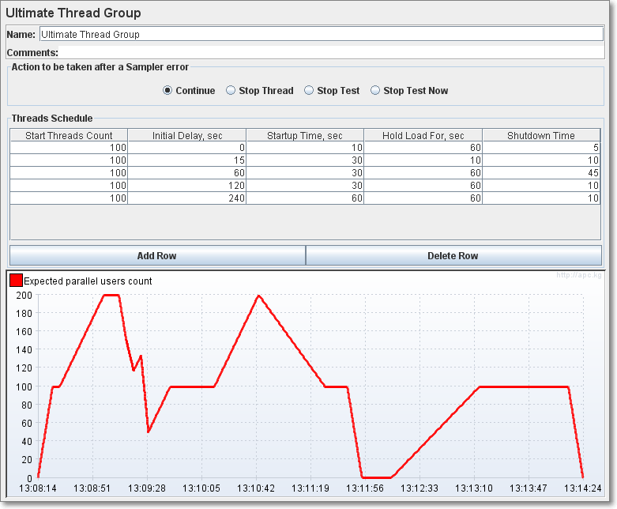
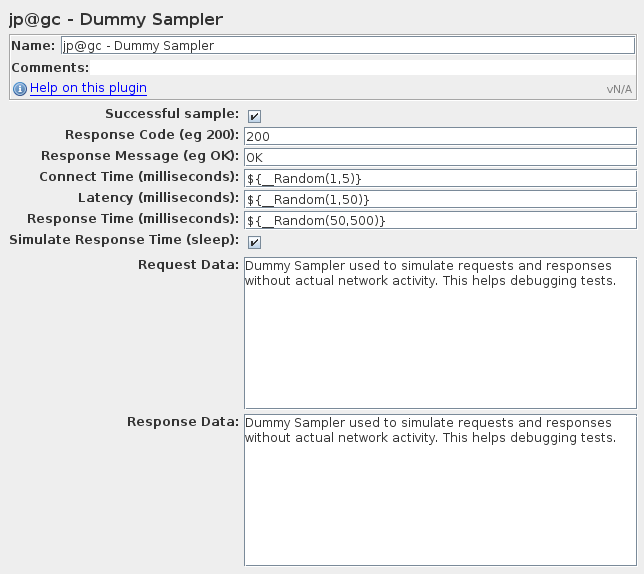

<!-- section 0 -->

# jMeter Workshop {#jmeter-workshop .light-on-dark bgcss="sea-gradient" x="0" y="0" rz="-.1"}

{height="20%" width="20%"}

<!-- section 1 -->

# jMeter Workshop

Agenda:

  Tag 1                           Tag 2
  ------------------------------- ------------------------------
  jMeter Plugin-Manager           Verteiltes Testen mit jMeter
  Strukturierung von Testplänen   RMI
  Workload Design                 Monitoring
  Scripting                       Containerisierung
  Reporting                       CI/CD-Pipeline
  Testdatenverwaltung             Klärung offener Punkte
  REST-APIs                       

<!-- section 2 -->

# jMeter Plugin-Manager {#jmeter-plugin-manager .light-on-dark bgcss="sea-gradient" x="0" y="0" rz="-.1"}

<!-- section 3 -->

# jMeter Plugin-Manager

<https://jmeter-plugins.org/wiki/PluginsManager/>

**Installation:**

-   lade **<https://jmeter-plugins.org/get/>** herunter
-   kopiere **jar** in das jMeter-Verzeichnis **lib/ext**

<!-- section 4 -->

# jMeter Plugin-Manager

**Ausführung über die Kommandozeile:**

<https://jmeter-plugins.org/wiki/PluginsManagerAutomated/>

`PluginsManagerCMD <command> [<params>]`

z.B.

`PluginsManagerCMD install jpgc-fifo,jpgc-json=2.2`

<!-- section 5 -->

# jMeter Plugin-Manager

**Falls man hinter einem Proxy ist:**

`JVM_ARGS="-Dhttps.proxyHost=myproxy.com -Dhttps.proxyPort=8080 -Dhttp.proxyUser=john -Dhttp.proxyPass=***" PluginsManagerCMD status`

<!-- section 6 -->

# jMeter Plugin-Manager

**Eigenes Plugin schreiben:**

<https://jmeter.apache.org/usermanual/jmeter_tutorial.html>

**Eigenes Repository hinzufügen:**

jMeter-Property setzen:

`jpgc.repo.address=https://jmeter-plugins.org/repo/;http://my.intranet.site/plugins-repo.json`

Das Repository-JSON muss folgendes Format erfüllen: <https://jmeter-plugins.org/wiki/PluginRepositoryDescriptorFormat/>

<!-- section 7 -->

# jMeter Plugin-Manager

**Nützliche Plugins:**

-   Ultimate Thread Group
-   Concurrency Thread Group
-   JMXMon Sample Collector
-   jp\@gc - PerfMon
-   jp\@gc - Dummy Sampler
-   jp\@gc - PlanCheck

<!-- section 8 -->

# jMeter Plugin-Manager

**Ultimate Thread Group**

{height="40%" width="40%"}

<!-- section 9 -->

# jMeter Plugin-Manager

**Concurrency Thread Group**

{height="40%" width="40%"}

<!-- section 10 -->

# jMeter Plugin-Manager

**jp\@gc - PerfMon**

{height="40%" width="40%"}

<!-- section 11 -->

# jMeter Plugin-Manager

**jp\@gc - Dummy Sampler**

{height="40%" width="40%"}

<!-- section 12 -->

# jMeter Plugin-Manager

**jp\@gc - PlanCheck**

<https://jmeter-plugins.org/wiki/TestPlanCheckTool/>

Usage:

`jmeter/lib/ext/TestPlanCheck.sh --jmx MyTestPlan.jmx --stats --tree-dump`

<!-- section 13 -->

# jMeter Plugin-Manager

**JMXMon Sample Collector**

{height="40%" width="40%"}

<!-- section 14 -->

# Strukturierung von Testplänen {#strukturierung-von-testplänen .light-on-dark bgcss="sea-gradient" x="0" y="0" rz="-.1"}

<!-- section 15 -->

# Thread Groups, Sampler und Controller

<!-- section 16 -->

# Timers

<!-- section 17 -->

# Assertions und Listener

<!-- section 18 -->

# Pre- und Post-Prozessoren

<!-- section 19 -->

# Config-Elemente, Cookie-Manager, Header-Manager

<!-- section 20 -->

# User-definierte Variable

<!-- section 21 -->

# Workload Design {#workload-design .light-on-dark bgcss="sea-gradient" x="0" y="0" rz="-.1"}

<!-- section 22 -->

# Zeitliche Verteilung der Last

<!-- section 23 -->

# Erkennen der Last-Grenzen / Server-Bedarfs

<!-- section 24 -->

# Scripting {#scripting .light-on-dark bgcss="sea-gradient" x="0" y="0" rz="-.1"}

<!-- section 25 -->

# BeanShell

<!-- section 26 -->

# JSR223

<!-- section 27 -->

# RegEx-Extractor

<!-- section 28 -->

# Arbeiten mit JARs

<!-- section 29 -->

# Reporting {#reporting .light-on-dark bgcss="sea-gradient" x="0" y="0" rz="-.1"}

<!-- section 30 -->

# Arten von Reporting

<!-- section 31 -->

# Ergebnis-Analyse

<!-- section 32 -->

# Testdatenverwaltung {#testdatenverwaltung .light-on-dark bgcss="sea-gradient" x="0" y="0" rz="-.1"}

<!-- section 33 -->

# Testdaten in .json-Datei / .csv-Datei

<!-- section 34 -->

# jMeter-Funktionen zur Datengenerierung

<!-- section 35 -->

# REST-APIs {#rest-apis .light-on-dark bgcss="sea-gradient" x="0" y="0" rz="-.1"}

<!-- section 36 -->

# Nutzung des Test-Rekorders

<!-- section 37 -->

# Testen mit "Http-Request"

<!-- section 38 -->

# Umgang mit Sessions/Authentification

<!-- section 39 -->

# Umgang mit dynamischen Daten

<!-- section 40 -->

# Verteiltes Testen mit jMeter {#verteiltes-testen-mit-jmeter .light-on-dark bgcss="sea-gradient" x="0" y="0" rz="-.1"}

<!-- section 41 -->

# Master-Slave-Setup

<!-- section 42 -->

# Testausführung über CLI

<!-- section 43 -->

# RMI {#rmi .light-on-dark bgcss="sea-gradient" x="0" y="0" rz="-.1"}

<!-- section 44 -->

# Diskussion: aktueller verwendeter RMI-Sampler

<!-- section 45 -->

# Vergleich mit existierende RMI-Samplern auf Github

<!-- section 46 -->

# Monitoring {#monitoring .light-on-dark bgcss="sea-gradient" x="0" y="0" rz="-.1"}

<!-- section 47 -->

# Prometheus / Grafana

<!-- section 48 -->

# YourKit-Profiler

<!-- section 49 -->

# Containerisierung {#containerisierung .light-on-dark bgcss="sea-gradient" x="0" y="0" rz="-.1"}

<!-- section 50 -->

# IaC: Infrastructure as a Code

> Mit IaC (Infrastructure as Code) wird die Infrastruktur durch Code -- und nicht durch manuelle Prozesse -- verwaltet und provisioniert.

> Mit IaC werden Konfigurationsdateien erstellt, die Ihre gesamten Infrastrukturspezifikationen enthalten, wodurch Sie Konfigurationen einfacher bearbeiten und verteilen können.
> Es stellt außerdem sicher, dass Sie jedes Mal dieselbe Umgebung provisionieren.

> Ein wichtiger Bestandteil von IaC ist die Versionskontrolle. Wie jede andere Software-Quellcodedatei sollten auch Ihre Konfigurationsdateien der Quellkontrolle unterliegen.

<!-- section 51 -->

# Vagrant

<!-- section 52 -->

# Docker / Docker-Compose

<!-- section 53 -->

# Kubernetes

<!-- section 54 -->

# CI/CD-Pipeline {#cicd-pipeline .light-on-dark bgcss="sea-gradient" x="0" y="0" rz="-.1"}

<!-- section 55 -->

# Github Actions

https://github.com/marketplace/actions/setup-jmeter
https://github.com/marketplace/actions/apache-jmeter
https://github.com/marketplace/actions/perfaction-for-jmeter
https://www.redline13.com/blog/2021/10/github-actions-for-jmeter/
https://dev.to/sebiboga/generate-jmeter-test-report-and-save-it-as-artifact-with-github-actions-4a6b
https://stackoverflow.com/questions/68084554/fail-github-actions-pipeline-if-dockerized-jmeter-tests-failed

<!-- section 56 -->

# jMeter in einer Github-Actions Pipeline

<!-- section 57 -->

# JMeter in einer Jenkins-Pipeline

<!-- section 58 -->

# Klärung offener Punkt {#klärung-offener-punkt .light-on-dark bgcss="sea-gradient" x="0" y="0" rz="-.1"}
